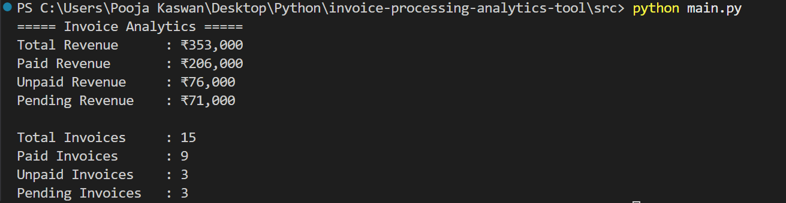

# Invoice Processing & Analytics Tool

A Python-based application that processes invoice data from a CSV file and generates business analytics using the pandas library. The project demonstrates data processing, modular programming, and automated invoice analysis.

## Project Preview



## Features

- Load invoice data from a CSV file
- Calculate total revenue
- Calculate paid, unpaid, and pending revenue
- Count total invoices
- Count invoices by payment status
- Modular project structure for better maintainability

## Project Structure

```
invoice-processing-analytics-tool/
│
├── Data/
│   └── invoices.csv
│
├── Reports/
│
├── src/
│   ├── analytics.py
│   ├── main.py
│   └── utils.py
│
├── requirements.txt
└── README.md
```

## Technologies Used

- Python 3
- pandas

## Installation

1. Clone the repository

```bash
git clone https://github.com/PoojaKaswan/invoice-processing-analytics-tool.git
```

2. Navigate to the project directory

```bash
cd invoice-processing-analytics-tool
```

3. Install the required packages

```bash
pip install -r requirements.txt
```

4. Run the application

```bash
cd src
python main.py
```

## Sample Output

```
===== Invoice Analytics =====

Total Revenue      : ₹353,000
Paid Revenue       : ₹205,000
Unpaid Revenue     : ₹76,000
Pending Revenue    : ₹72,000

Total Invoices     : 15
Paid Invoices      : 8
Unpaid Invoices    : 3
Pending Invoices   : 4
```

## Learning Outcomes

Through this project, I practiced:

- Python programming
- Data analysis using pandas
- Reading CSV files
- Modular programming
- Business data analytics

## Future Improvements

- Generate PDF and CSV reports
- AI-generated business summaries using an LLM
- Interactive dashboard
- Excel file support

## Author

**Pooja Kaswan**